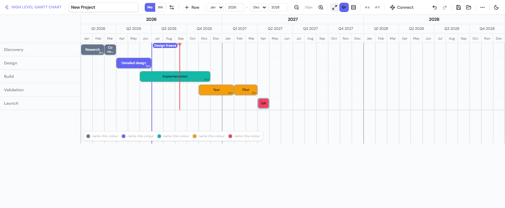

# High Level Gantt Chart

An offline-first, single-page app for **drawing** program-plan charts. You drag rectangles
onto rows, connect them with arrows, and export a picture or a JSON file.

It is deliberately not a scheduling tool. Dependency arrows are geometry, not constraints —
nothing recalculates when you move a bar, there is no critical path, and there is no
resource model. The product is a chart you can put in a briefing deck, not a plan a solver
maintains. See [`docs/improvement-roadmap.md`](docs/improvement-roadmap.md) for what that
rules in and out.



## Features

- **Rows** — add, rename, reorder, delete, and merge name cells across rows
- **Activities** — drag on empty timeline to create, or double-click for a single unit;
  move, resize from either edge, span multiple rows, recolour, rename inline, annotate
- **Milestones** — diamond markers, convertible to and from activities
- **Dependencies** — toggle connect mode, drag anchor-to-anchor, orthogonal SVG arrows
- **Two timeline modes** — months (year / quarter / month header) and weeks (month / week
  header). These are *separate charts*, not two views of one
- **Zoom, fit-to-view, row height, font size, quarter toggle, light/dark theme**
- **Undo/redo** — 50 steps, one entry per gesture
- **Persistence** — autosave to the browser, named saves, JSON import/export, and a JPEG
  snapshot to clipboard and disk
- **Touch and PWA** — pointer events throughout, installable, fullscreen

## Getting started

```bash
pnpm install
pnpm dev
```

Then open the printed URL. Note that the app is served under `/gantt/`.

## Commands

| Command | What it does |
|---|---|
| `pnpm dev` | Vite dev server |
| `pnpm build` | Type-check and build to `dist/` |
| `pnpm lint` | ESLint |
| `pnpm test` | Vitest (`pnpm test:watch` for watch mode) |
| `pnpm preview` | Serve the production build locally |
| `pnpm build:single` | One self-contained HTML file in `dist-single/` |
| `pnpm build:exe` | Standalone Windows EXE in `dist-exe/` |
| `pnpm deploy:gh` | Build and publish to GitHub Pages |

If a script fails with `Cannot find module .../node_modules/<tool>`, the pnpm links are
stale because the folder moved. Run `CI=true pnpm install`.

## Distribution

Four outputs from one source tree — a dev server, a GitHub Pages deploy, a single-file HTML
you can email, and a standalone Windows EXE that bundles a Node runtime and opens your
browser on launch. They differ mainly in base path, which is where the traps are:
see [`docs/build-and-distribution.md`](docs/build-and-distribution.md).

The EXE is unsigned, so Windows SmartScreen prompts "More info" → "Run anyway" on first
launch.

## Documentation

| Document | Contents |
|---|---|
| [`docs/architecture.md`](docs/architecture.md) | How the layers fit together; where to start for a given change |
| [`docs/data-model.md`](docs/data-model.md) | Persisted schema, storage keys, migration |
| [`docs/build-and-distribution.md`](docs/build-and-distribution.md) | The four build modes |
| [`docs/improvement-roadmap.md`](docs/improvement-roadmap.md) | Prioritised backlog and known-defect register |
| [`CLAUDE.md`](CLAUDE.md) | Instructions for Claude Code; `.claude/rules/` holds path-scoped detail |

## Tech stack

React 19 · TypeScript 5.9 · Vite 7 · Zustand 5 (immer + zundo) · Tailwind CSS 4 ·
Radix / shadcn primitives · lucide-react · Vitest
